# OpenClaw 🦞

> _"EXFOLIATE! EXFOLIATE!"_ — A space lobster, probably

<p align="center">
    
    
</p>

<p align="center">
  <strong>Any OS + WhatsApp/Telegram/Discord/iMessage gateway for AI agents (Pi).</strong><br />
  Plugins add Mattermost and more.
  Send a message, get an agent response — from your pocket.
</p>

<p align="center">
  <a href="https://github.com/openclaw/openclaw">GitHub</a> ·
  <a href="https://github.com/openclaw/openclaw/releases">Releases</a> ·
  <a href="/">Docs</a> ·
  <a href="/start/openclaw">OpenClaw assistant setup</a>
</p>

OpenClaw bridges WhatsApp (via WhatsApp Web / Baileys), Telegram (Bot API / grammY), Discord (Bot API / channels.discord.js), and iMessage (imsg CLI) to coding agents like [Pi](https://github.com/badlogic/pi-mono). Plugins add Mattermost (Bot API + WebSocket) and more.
OpenClaw also powers the OpenClaw assistant.

## Start here

- **New install from zero:** [Getting Started](/start/getting-started)
- **Guided setup (recommended):** [Wizard](/start/wizard) (`openclaw onboard`)
- **Open the dashboard (local Gateway):** http://127.0.0.1:18789/ (or http://localhost:18789/)

If the Gateway is running on the same computer, that link opens the browser Control UI
immediately. If it fails, start the Gateway first: `openclaw gateway`.

## Dashboard (browser Control UI)

The dashboard is the browser Control UI for chat, config, nodes, sessions, and more.
Local default: http://127.0.0.1:18789/
Remote access: [Web surfaces](/web) and [Tailscale](/gateway/tailscale)

<p align="center">
  
</p>

## How it works

```mermaid
%%{init: {
  'theme': 'base',
  'themeVariables': {
    'primaryColor': '#ffffff',
    'primaryTextColor': '#000000',
    'primaryBorderColor': '#000000',
    'lineColor': '#000000',
    'secondaryColor': '#f9f9fb',
    'tertiaryColor': '#ffffff',
    'clusterBkg': '#f9f9fb',
    'clusterBorder': '#000000',
    'nodeBorder': '#000000',
    'mainBkg': '#ffffff',
    'edgeLabelBackground': '#ffffff'
  }
}}%%
flowchart TB
 subgraph Clients["Messaging Clients"]
        IM["iMessage (+ plugins)"]
        DC["Discord"]
        TG["Telegram"]
        WA["WhatsApp"]
  end
 subgraph Nodes["Agents / Nodes"]
        ChatUI["Chat UI<br>(SwiftUI)"]
        CLI["CLI<br>(openclaw …)"]
        Pi["Pi Agent<br>(RPC)"]
        Android["Android Node<br>via Gateway WS + pairing"]
        iOS["iOS Node<br>via Gateway WS + pairing"]
        Mac["MacOS App<br>(openClaw.app)"]
  end
    WA ~~~ TG
    TG ~~~ DC
    DC ~~~ IM
    Pi ~~~ CLI
    CLI ~~~ ChatUI
    Mac ~~~ iOS
    iOS ~~~ Android
    Clients --> Gateway["<b>Gateway (single source)<br></b><br>ws://127.0.0.1:18789 (loopback-only)<br><br>http://:18793\n/__openclaw__/canvas/ (Canvas host)"]
    Gateway --> Nodes
```



Most operations flow through the **Gateway** (`openclaw gateway`), a single long-running process that owns channel connections and the WebSocket control plane.

## Network model

- **One Gateway per host (recommended)**: it is the only process allowed to own the WhatsApp Web session. If you need a rescue bot or strict isolation, run multiple gateways with isolated profiles and ports; see [Multiple gateways](/gateway/multiple-gateways).
- **Loopback-first**: Gateway WS defaults to `ws://127.0.0.1:18789`.
  - The wizard now generates a gateway token by default (even for loopback).
  - For Tailnet access, run `openclaw gateway --bind tailnet --token ...` (token is required for non-loopback binds).
- **Nodes**: connect to the Gateway WebSocket (LAN/tailnet/SSH as needed); legacy TCP bridge is deprecated/removed.
- **Canvas host**: HTTP file server on `canvasHost.port` (default `18793`), serving `/__openclaw__/canvas/` for node WebViews; see [Gateway configuration](/gateway/configuration) (`canvasHost`).
- **Remote use**: SSH tunnel or tailnet/VPN; see [Remote access](/gateway/remote) and [Discovery](/gateway/discovery).

## Features (high level)

- 📱 **WhatsApp Integration** — Uses Baileys for WhatsApp Web protocol
- ✈️ **Telegram Bot** — DMs + groups via grammY
- 🎮 **Discord Bot** — DMs + guild channels via channels.discord.js
- 🧩 **Mattermost Bot (plugin)** — Bot token + WebSocket events
- 💬 **iMessage** — Local imsg CLI integration (macOS)
- 🤖 **Agent bridge** — Pi (RPC mode) with tool streaming
- ⏱️ **Streaming + chunking** — Block streaming + Telegram draft streaming details ([/concepts/streaming](/concepts/streaming))
- 🧠 **Multi-agent routing** — Route provider accounts/peers to isolated agents (workspace + per-agent sessions)
- 🔐 **Subscription auth** — Anthropic (Claude Pro/Max) + OpenAI (ChatGPT/Codex) via OAuth
- 💬 **Sessions** — Direct chats collapse into shared `main` (default); groups are isolated
- 👥 **Group Chat Support** — Mention-based by default; owner can toggle `/activation always|mention`
- 📎 **Media Support** — Send and receive images, audio, documents
- 🎤 **Voice notes** — Optional transcription hook
- 🖥️ **WebChat + macOS app** — Local UI + menu bar companion for ops and voice wake
- 📱 **iOS node** — Pairs as a node and exposes a Canvas surface
- 📱 **Android node** — Pairs as a node and exposes Canvas + Chat + Camera

Note: legacy Claude/Codex/Gemini/Opencode paths have been removed; Pi is the only coding-agent path.

## Quick start

Runtime requirement: **Node ≥ 22**.

```bash
# Recommended: global install (npm/pnpm)
npm install -g openclaw@latest
# or: pnpm add -g openclaw@latest

# Onboard + install the service (launchd/systemd user service)
openclaw onboard --install-daemon

# Pair WhatsApp Web (shows QR)
openclaw channels login

# Gateway runs via the service after onboarding; manual run is still possible:
openclaw gateway --port 18789
```

Switching between npm and git installs later is easy: install the other flavor and run `openclaw doctor` to update the gateway service entrypoint.

From source (development):

```bash
git clone https://github.com/openclaw/openclaw.git
cd openclaw
pnpm install
pnpm ui:build # auto-installs UI deps on first run
pnpm build
openclaw onboard --install-daemon
```

If you don’t have a global install yet, run the onboarding step via `pnpm openclaw ...` from the repo.

Multi-instance quickstart (optional):

```bash
OPENCLAW_CONFIG_PATH=~/.openclaw/a.json \
OPENCLAW_STATE_DIR=~/.openclaw-a \
openclaw gateway --port 19001
```

Send a test message (requires a running Gateway):

```bash
openclaw message send --target +15555550123 --message "Hello from OpenClaw"
```

## Configuration (optional)

Config lives at `~/.openclaw/openclaw.json`.

- If you **do nothing**, OpenClaw uses the bundled Pi binary in RPC mode with per-sender sessions.
- If you want to lock it down, start with `channels.whatsapp.allowFrom` and (for groups) mention rules.

Example:

```json5
{
  channels: {
    whatsapp: {
      allowFrom: ["+15555550123"],
      groups: { "*": { requireMention: true } },
    },
  },
  messages: { groupChat: { mentionPatterns: ["@openclaw"] } },
}
```

## Docs

- Start here:
  - [Docs hubs (all pages linked)](/start/hubs)
  - [Help](/help) ← _common fixes + troubleshooting_
  - [Configuration](/gateway/configuration)
  - [Configuration examples](/gateway/configuration-examples)
  - [Slash commands](/tools/slash-commands)
  - [Multi-agent routing](/concepts/multi-agent)
  - [Updating / rollback](/install/updating)
  - [Pairing (DM + nodes)](/start/pairing)
  - [Nix mode](/install/nix)
  - [OpenClaw assistant setup](/start/openclaw)
  - [Skills](/tools/skills)
  - [Skills config](/tools/skills-config)
  - [Workspace templates](/reference/templates/AGENTS)
  - [RPC adapters](/reference/rpc)
  - [Gateway runbook](/gateway)
  - [Nodes (iOS/Android)](/nodes)
  - [Web surfaces (Control UI)](/web)
  - [Discovery + transports](/gateway/discovery)
  - [Remote access](/gateway/remote)
- Providers and UX:
  - [WebChat](/web/webchat)
  - [Control UI (browser)](/web/control-ui)
  - [Telegram](/channels/telegram)
  - [Discord](/channels/discord)
  - [Mattermost (plugin)](/channels/mattermost)
  - [iMessage](/channels/imessage)
  - [Groups](/concepts/groups)
  - [WhatsApp group messages](/concepts/group-messages)
  - [Media: images](/nodes/images)
  - [Media: audio](/nodes/audio)
- Companion apps:
  - [macOS app](/platforms/macos)
  - [iOS app](/platforms/ios)
  - [Android app](/platforms/android)
  - [Windows (WSL2)](/platforms/windows)
  - [Linux app](/platforms/linux)
- Ops and safety:
  - [Sessions](/concepts/session)
  - [Cron jobs](/automation/cron-jobs)
  - [Webhooks](/automation/webhook)
  - [Gmail hooks (Pub/Sub)](/automation/gmail-pubsub)
  - [Security](/gateway/security)
  - [Troubleshooting](/gateway/troubleshooting)

## The name

**OpenClaw = CLAW + TARDIS** — because every space lobster needs a time-and-space machine.

---

_"We're all just playing with our own prompts."_ — an AI, probably high on tokens

## Credits

- **Peter Steinberger** ([@steipete](https://x.com/steipete)) — Creator, lobster whisperer
- **Mario Zechner** ([@badlogicc](https://x.com/badlogicgames)) — Pi creator, security pen-tester
- **Clawd** — The space lobster who demanded a better name

## Core Contributors

- **Maxim Vovshin** (@Hyaxia, 36747317+Hyaxia@users.noreply.github.com) — Blogwatcher skill
- **Nacho Iacovino** (@nachoiacovino, nacho.iacovino@gmail.com) — Location parsing (Telegram + WhatsApp)

## License

MIT — Free as a lobster in the ocean 🦞

---

_"We're all just playing with our own prompts."_ — An AI, probably high on tokens
